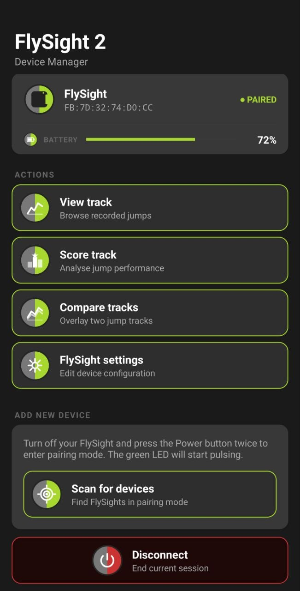
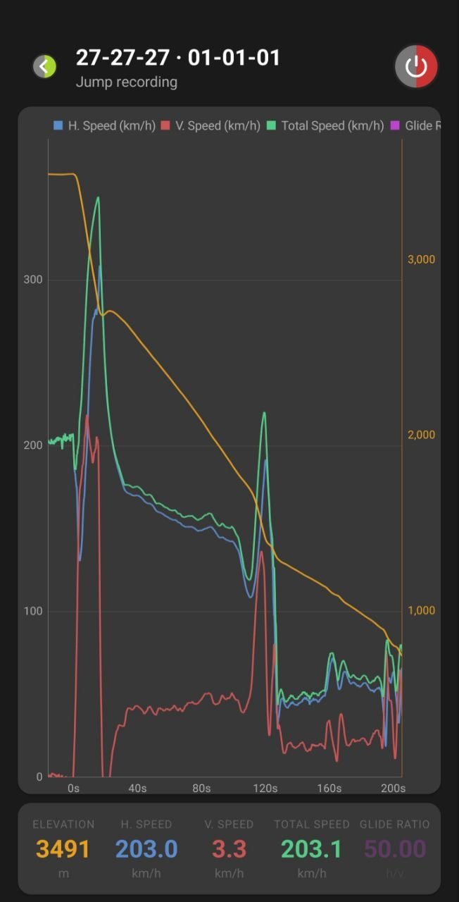
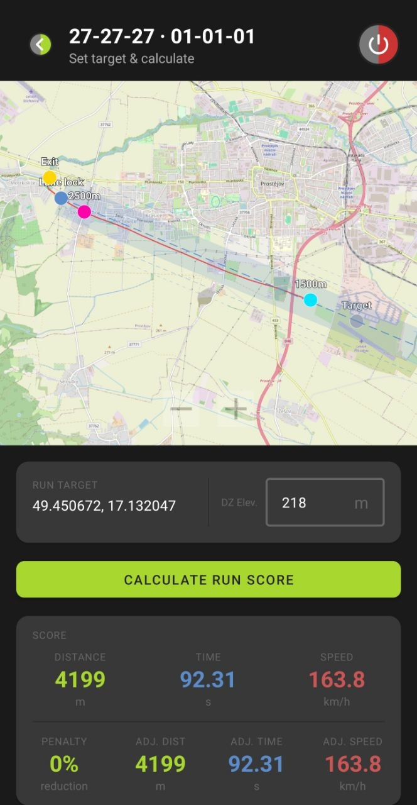
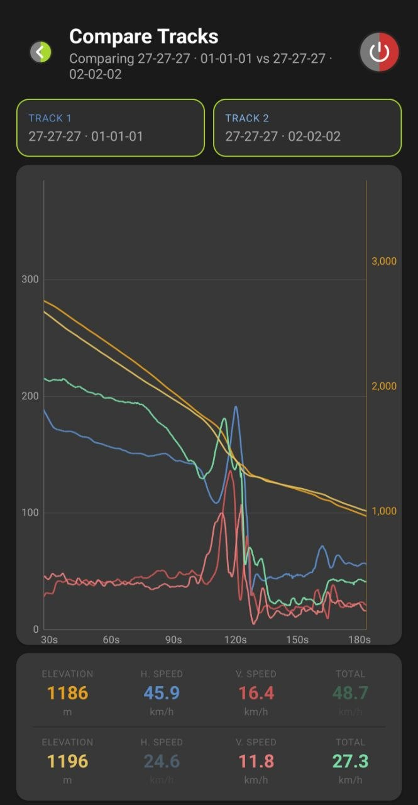
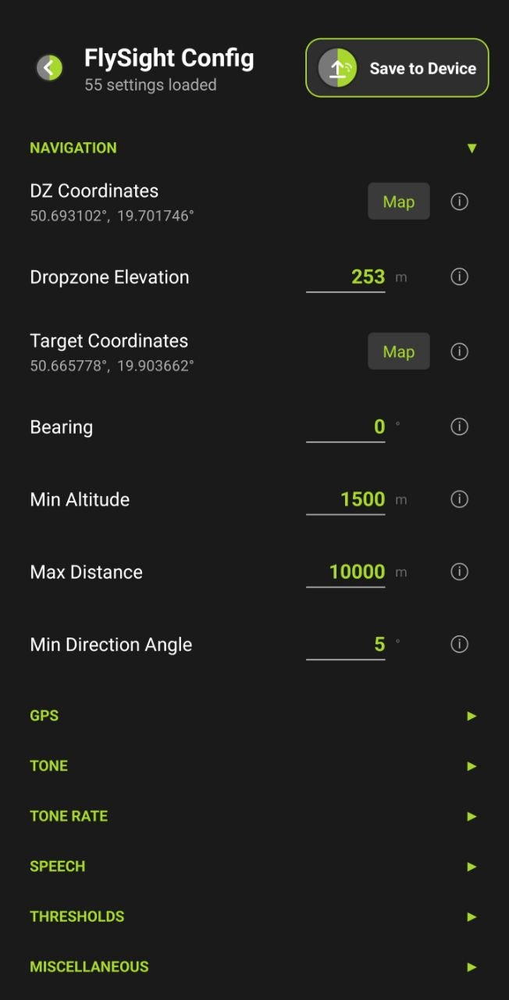

# FlySight Android

An Android companion app for the [FlySight 2](http://flysight.ca/) GPS skydiving/wingsuit computer. Connects over Bluetooth Low Energy to browse device files, download jump tracks, configure the device, and score competition runs.

---

## Screenshots

| Main Screen | Track Details | Score Run |
|---|---|---|
|  |  |  |

| Compare Tracks | Device Settings |
|---|---|
|  |  |

---

## Installation

### 1. Update FlySight 2 firmware

The app requires FlySight 2 firmware **v2024.12.30.10** (released May 2026) or later. Older firmware versions do not enable Bluetooth. Full update instructions: https://flysight.ca/firmware/

### 2. Install the app

Download the latest APK from the [Releases](../../releases) page and install it on your Android device. You may need to allow installation from unknown sources in your device settings.

### 3. Pair your FlySight

1. **Power off** the FlySight and disconnect it from USB.
2. Press the Power button **twice** — the device switches to Pairing mode and the LED begins to blink slowly.
3. Open the app and tap **Scan** to discover and pair with the device.

Once paired, the FlySight is always reachable over BLE whenever it is powered off and within range — no need to re-enter Pairing mode for subsequent connections.

### Known limitations (Alpha)

- **Battery level** is not displayed. This is a firmware-side limitation and will be resolved in a future FlySight firmware update.
- **File access requires the device to be powered off.** The current firmware blocks SD card access while the device is active.
- **Configuration is saved as `DEMO_CFG.TXT`**, not `CONFIG.TXT`, to prevent accidentally overwriting your existing configuration. Once the generated output has been fully validated, this will change to write directly to `CONFIG.TXT`. In the meantime you can manually rename or copy the file — verify all settings before doing so.
- **Score track results differ from desktop FlySight Viewer by ~0.1–0.2%** (roughly 10 m in the distance score). The root cause is still under investigation.

---

## Features

### Device Connection
- Scans for nearby FlySight 2 devices and displays already-paired devices
- Handles BLE bonding and pairing automatically
- Shows live battery level once connected
- High-priority BLE connection mode during file transfers for maximum throughput

### File Browser
- Navigate the full FlySight 2 directory tree over BLE
- Download and view individual track files
- Delete files and folders directly from the app

### Jump Track Viewer
- Downloads `TRACK.CSV` over BLE and parses GPS data
- Interactive line chart displaying:
  - Horizontal speed, vertical speed, total speed (km/h)
  - Elevation (m)
  - Glide ratio
- Tap any chart series header to toggle visibility
- Pinch-to-zoom and drag on the time axis

### Run Scorer (PPC)
- Scores a competition Performance Piloting run between 2500 m and 1500 m AGL
- Displays time (s), distance (m), speed (km/h), and adjusted values after penalty
- Map view (OpenStreetMap) with:
  - Flight track from exit to 1500 m gate
  - Official scoring lane (semi-transparent fill, ±300 m from centre)
  - ±150 m and ±300 m penalty zone boundary lines
  - Lock-in, exit, 2500m and 1500m gate markers
  - Lane extended to 5 miles beyond the target
- Long-press map to set scoring target
- Penalty calculation: 0% / 10% / 20% / 50% based on cross-track deviation

### Track Comparison
- Download two tracks and overlay them on the same chart
- Compare horizontal speed, vertical speed, total speed, and elevation side-by-side

### Device Configuration
- Read and write the FlySight 2 configuration file over BLE
- Settings organised into collapsible sections (navigation, GPS, audio, alarms, sensors, etc.)

---

## Requirements

| Requirement | Version |
|---|---|
| Android | 8.0 (API 26) or higher |
| Target SDK | 34 (Android 14) |
| Bluetooth | BLE required |
| FlySight firmware | FlySight 2 |

---

## Building

### Prerequisites

- Android Studio Hedgehog (2023.1) or later
- JDK 17
- Android SDK with API 34 platform tools

### Steps

1. **Clone the repository**
   ```bash
   git clone https://github.com/<your-org>/flysight-android.git
   cd flysight-android
   ```

2. **Open in Android Studio**
   File → Open → select the cloned directory

3. **Build a debug APK from the command line**
   ```bash
   ./gradlew assembleDebug
   ```
   Output: `app/build/outputs/apk/debug/app-debug.apk`

4. **Install directly to a connected device**
   ```bash
   ./gradlew installDebug
   ```

### Gradle version

Gradle **8.10.2** — managed via the Gradle Wrapper (`gradle/wrapper/`). No separate Gradle installation is required.

---

## Permissions

| Permission | Purpose |
|---|---|
| `BLUETOOTH_SCAN` | Discover nearby FlySight devices |
| `BLUETOOTH_CONNECT` | Connect, bond, and transfer data |
| `ACCESS_FINE_LOCATION` | Required by Android for BLE scanning; used for GPS map centering |
| `INTERNET` | Load OpenStreetMap tiles in the scoring map view |

---

## Dependencies

| Library | Purpose |
|---|---|
| [MPAndroidChart](https://github.com/PhilJay/MPAndroidChart) | Track data charts |
| [OSMDroid](https://github.com/osmdroid/osmdroid) | OpenStreetMap scoring map |
| Kotlin Coroutines 1.7.3 | Async BLE operations and UI state |
| AndroidX Lifecycle / ViewModel | State management across configuration changes |
| Material Design 3 | UI components and dark theme |
